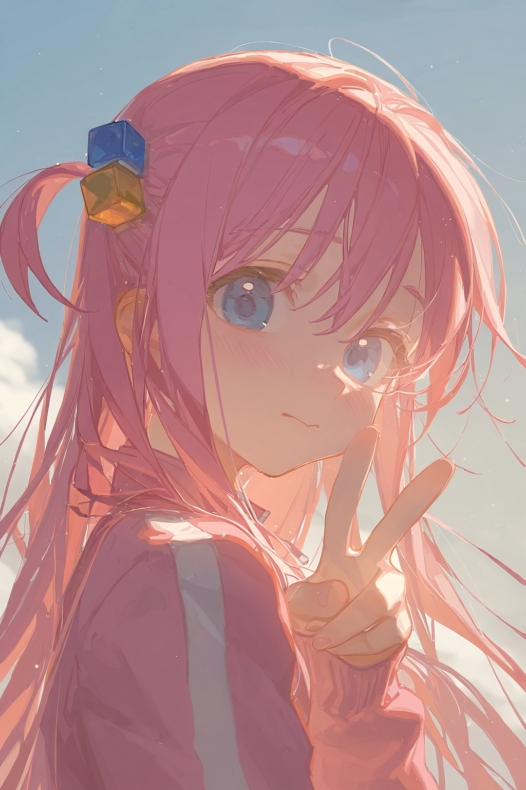

# 使用[ComfyUI](https://github.com/comfyanonymous/ComfyUI): 从零开始~~制作涩图~~AI绘画

QQ群: 670194395

取图: https://github.com/AhiruNeko/AIPainting/tree/main/Pictures

## 快速开始

### AI绘画的基本原理是什么?

**1. 提示词编码**

将文字提示转换为向量表示, 供模型理解

**2.  随机噪声初始化**

生成一张潜空间中的随机噪声图像, 作为起点

**3. 扩散采样(反向去噪)**

结合提示词, 逐步引导latent图像向目标图像逼近

**4. 图像解码(VAE Decode)**

将处理完成的latent图像还原为可视图像

**5. 图像输出**

显示或保存最终生成的图像

**简单来讲, AI绘画就是根据提示词通过不断地预测一张随机噪声图中不必要的部分, 从而对其进行降噪, 最后降噪为我们需要的图片**

### ComfyUI基本工作流怎么搭建？

根据AI绘画原理, 我们可以搭建出以下这个基本工作流:


其中：
- `Checkpoint加载器(简易)`: 用于加载你的AI绘画基本模型, AI模型应放置于comfyUI文件夹下的models/checkpoints路径下
- `CLIP文本编码器`: 用于输入正向提示词和反向提示词
- `空Latent`: 用于生成初始latent图像作为起点
- `K采样器`: 用于控制噪声逐步去除过程的组件, 将随机或编码图像逐步变换为符合提示词的图像
- `VAE解码`: 将处理完成的latent图像还原为可视图像
- `保存图像`: 保存图像至本地

现在你就能搭建最简单的comfyUI工作流啦!

## 进阶一: 同人图制作与图生图(img2img)技术

### 检查你的checkpoint模型

下载模型时一般会有一些参数需要注意, 这里以[civitai](https://civitai.com)为例:


其中, Based Model指的是这个模型的类型. 常见的类型有SD1.5, SDXL, Illustrious, Pony, NAI等, 不同的模型在使用时有所不同.

这张图中, 我们可以看见这个模型的Based Model是NAI

### 如何制作同人图?
通常有两种方法: 

**1. 使用模型直接生成**

有的模型在训练时就已经训练过一些热门角色, 例如NoobAI就包含[danbooru](Materials/danbooru_artist_webui.csv)中的角色

对于这样的模型只需要直接在提示词里写上角色名, 作品名, 以及角色的简单外貌描述即可生成该角色的同人图

例如: 

```
1girl, gotou hitori, bocchi the rock!, blue eyes, pink hair,cube hair ornament, ahoge, bangs, hair between eyes
```

这里首先声明了**角色数量**(1girl), 然后声明了**角色与作品**(gotou hitori, bocchi the rock!), 最后简单描述了**角色外貌**(blue eyes, pink hair,cube hair ornament, ahoge, bangs, hair between eyes), 于是我们就能得到波奇酱的图片了

**2. 使用LoRA生成**

LoRA(Low-Rank Adaptation)是一种高效微调大模型的方法, 常用于 AI 绘图中定制特定风格或人物. LoRA模型应放置于comfyUI文件夹下的models/loras路径下

使用LoRA需要修改工作流: 


可以看到这里将LoRA模型和checkpoint模型串联, 相当于是一个新模型, 其中, LoRA模型有以下参数:

- `模型强度`: 控制 LoRA 对 UNet(图像生成核心模块)的影响程度, 数值越高, 图像更符合 LoRA 的风格或角色
- `CLIP 强度`: 控制 LoRA 对文本编码器(CLIP)的影响程度, 数值越高, 能更强地引导提示词的语义并提高提示词对结果的控制力

**这两个参数均可为负数, 为负数时将起到抑制的效果**

不同的LoRA有不同的适用环境, 在下载时可以看见这些参数, 这里以[civitai](https://civitai.com)为例: 


可以看到这里这个LoRA的Based Model是Pony, 也就是说这个LoRA只能与Pony的checkpoint模型配合使用

所有checkpoint模型的Based Model必须和LoRA模型的Based Model相同才能使用, 例如, SD1.5的LoRA一般不能给SDXL的checkpoint模型使用, 不过一般SDXL, NAI, Pony, Illustrious的LoRA可以通用.

此外, 我们还可以看到LoRA模型是有触发词(Trigger Words)的, 例如该图中的触发词是:

```
hitori gotou, blue eyes, cube hair ornament, hair between eyes, hair ornament, pink hair, one side up, long hair,
```
```
black skirt, jacket, long sleeves, pants, pants under skirt, pink jacket, pink pants, pleated skirt, skirt, track jacket, track pants, track suit,
```
因此, 在使用LoRA时需要输入这些触发词才能使LoRA发挥作用, 生成特定的角色或风格

**总之, 找到能与你的checkpoint模型配合使用的LoRA模型后, 设置好LoRA参数并在提示词中输入触发词, 即可生成同人图**

### 如何搭建图生图工作流?
如图:


可以看到, 相较于基础工作流, 图生图工作流将`空Latent`替换成了`加载图像`和`VAE编码`, 即不再从一个空Latent开始生成, 而是将一张现有图片编码为Latent后进行生成

### K采样器在图生图工作流中如何设置?


可以看到K采样器有一个关键参数`降噪`, 该值指的是每一轮采样降噪的程度, 该值越大, 每次降噪就越强

在图生图工作流中, 该值越大, 那么对原图的重绘幅度越大. 因此可以通过调整这个数值来决定你希望保留原图的多少内容

### 图生图工作流有何应用?

**1. 画风重置**

通过对原图进行图生图重绘, 可以将原图转换为新的画风

**2. 内容迁移**

图生图技术可以迁移图片内容, 例如:

<a href="#">
    
    
</a>

其中右图由左图经过图生图而来, 可以看到右图迁移了左图的姿势与背景, 但更改了角色, 而且也进行了画风重置

**3. 细节修补**

在图片出现一些错误(例如六指, 姿势不当)时, 或者在手动修图后出现P图痕迹时, 可以使用图生图技术进行修补, 例如:

<a href="#">
    
    
</a>

其中右图由左图经过图生图而来, 其中左图的右脚是经过手动修理的, 可以看到有明显的P图痕迹, 所以将该图进行图生图重绘, 即可得到右图的无P图痕迹的版本

**注意: 无论时画风重置, 内容迁移, 还是细节修补, 都需要适当降低K采样器的降噪值(例如设置为0.6)以保证不会丢失我们想保留的内容**

## 进阶二: 画风调整

**这里将以一个画风调整的实战为例, 使用NoobAI-XL(NAI-XL)-V-Pred-0.75S-Version模型, 一步步介绍如何调整画风**

### STEP1: 确定你的画风调整方向

首先不输入任何负面提示词与画风提示词, 仅输入图片内容相关的正面提示词, 生成一张模型默认风格的图片

这里以一张波奇酱的正面照为例, K采样器参照ComfyUI的默认参数, 空Latent的大小设置为1024*1536, 在正面提示词中输入以下内容: 

```
1girl, solo, gotou hitori, pink hair, cube hair ornament, blue eyes, bangs, hair between eyes, long hair, pink jacket, track jacket, standing, looking at viewer, blush, shy, v, sky, cloud, wind, flying hair, sunshine, sunlight, side view, upper body, close-up
```

运行后得到最原始的图像(左图), 可以看到这确实是波奇酱的图片, 不过画风过于粗糙, 需要进行调整. 我们希望调整到右图的画风


<a href="#">
    
    
</a>

### STEP2: 初步品质提升

**1. 正面提示词**

我们可以在正面提示词中输入一些描述图画品质的词来提升作品质量, 例如`masterpiece`(杰作), `best quality`(最佳质量), `expressive`(富有表现力的)

于是, 我们将这些词放在提示词末尾, 得到新的正面提示词:

```
1girl, solo, gotou hitori, pink hair, cube hair ornament, blue eyes, bangs, hair between eyes, long hair, pink jacket, track jacket, standing, looking at viewer, blush, shy, v, sky, cloud, wind, flying hair, sunshine, sunlight, side view, upper body, close-up,

year 2023, masterpiece, expressive, depth of field, blurry background, dynamic lighting, light particle, best quality, very aesthetic, highres, absurdres
```

**2. 负面提示词**

在初始图像中我们可以发现有着手指错误, 质量低下不清晰等问题, 因此我们可以输入一些负面提示词来抑制低质量生成, 例如`extra fingers`(额外的手指), `worst quality`(最差的质量), `blurry`(模糊)

于是, 我们可以在负面提示词中输入以下内容:

```
error fingers, six fingers, lowres, bad anatomy, blurry, (worst quality:1.8), low quality, hands bad, extra fingers, (normal quality:1.3), bad hands, mutated hands and fingers, extra legs, extra arms, duplicate, cropped, jpeg, artifacts, long body, multiple breasts, mutated, disfigured, bad proportions, bad feet, ugly, text font ui, missing limb, monochrome, face bad
```

其中, 每个提示词的默认权重是1, 但是我们也可以调整提示词的权重, 例如`(worst quality:1.8)`就是指`worst quality`的权重为1.8

**现在, 我们可以得到以下图片:**


**可以看到画质确实提升了不少, 现在更加清晰了. 不过风格上还需要继续调整, 我们希望画风更加柔美些**

### STEP3: 略微调整K采样器参数

调整K采样器的参数也能对画风产生一定影响, 不过一般来说影响较小

前面已经介绍了K采样器的`降噪`参数, 现在简单介绍一些其他重要参数:

- `步数`: 图像生成的去噪迭代次数, 越多越细致, 但也更慢
- `CFG`: 引导强度, 数值越高越贴近提示词, 越低越自由发挥
- `采样器`: 选择使用哪种算法组合来进行去噪(通常决定采样稳定性与速度)
- `调度器`: 控制每一步的噪声去除节奏, 不同调度器会影响风格, 质量和细节表现

现在, 我们将`步数`调整为**45**, `CFG`调整为**6**, `采样器`调整为**euler**, `调度器`调整为**karras**, 运行后可以看到以下图片:


### STEP4: 使用画师串

**画师串**是指通过提示词, 模型或LoRA模拟特定画师画风来生成作品

有的checkpoint模型在训练时就自带一些画师的画风, 仅需在提示词中加入画师名字即可生成特定画师风格的图片

对于不支持画师串的checkpoint模型, 可以选择合适的**LoRA模型**来调用画师风格, 具体参考同人图的LoRA使用

在我们这个案例中, 可以直接在提示词里输入画师名字调整画风, 具体画师列表可参考[danbooru](Materials/danbooru_artist_webui.csv)

我们打算融合四位画师的风格来调整画风, 他们分别是: [tianliang_duohe_fangdongye](https://www.pixiv.net/users/15849699), [ask_(askzy)](https://www.pixiv.net/users/1980643), [ciloranko](https://www.pixiv.net/users/85372089), [sho_(sho_lwlw)](https://www.pixiv.net/users/30551748)

下面分别是这四位画师的作品:

<a href="#">
    
    
    
    
</a>

我们直接将这四个画师的名字加到正面提示词的开头:

```
tianliang_duohe_fangdongye, ask \(askzy\), ciloranko, sho_(sho_lwlw),

1girl, solo, gotou hitori, pink hair, cube hair ornament, blue eyes, bangs, hair between eyes, long hair, pink jacket, track jacket, standing, looking at viewer, blush, shy, v, sky, cloud, wind, flying hair, sunshine, sunlight, side view, upper body, close-up,

year 2023, masterpiece, expressive, depth of field, blurry background, dynamic lighting, light particle, best quality, very aesthetic, highres, absurdres
```

生成一下看看效果:


可以看到已经有这四位画师风格的雏形了. 接下来可以适当微调各个画师的权重:

```
tianliang_duohe_fangdongye, (ask \(askzy\):0.6), ciloranko, (sho_(sho_lwlw):0.8),

1girl, solo, gotou hitori, pink hair, cube hair ornament, blue eyes, bangs, hair between eyes, long hair, pink jacket, track jacket, standing, looking at viewer, blush, shy, v, sky, cloud, wind, flying hair, sunshine, sunlight, side view, upper body, close-up,

year 2023, masterpiece, expressive, depth of field, blurry background, dynamic lighting, light particle, best quality, very aesthetic, highres, absurdres
```

生成后得到以下图片:


通过与我们的目标画风对比, 我们可以发现现在的风格有点过于"浓"了, 主要表现在:
- 对比度, 饱和度过高
- 轮廓线过粗
因此需要进一步调整

### STEP5: 使用LoRA进行微调

由于饱和度, 对比度, 以及轮廓线粗细存在问题, 我们就使用这三个LoRA进行调整: 

- **add_contrast_XL.safetensors**(用于加对比度)
- **add_saturation_XL.safetensors**(用于加饱和度)
- **outline_xl_kohaku_delta_spv5x.safetensors**(用于加粗轮廓线)

因为我们需要降低对比度, 降低饱和度, 把轮廓线变细, 因此三个LoRA的模型强度都应该调整为负数, 这里分别调整为 **-2**, **-1**, **-1**

得到新的工作流, 如图所示:


运行后即可得到最终的目标画风:

