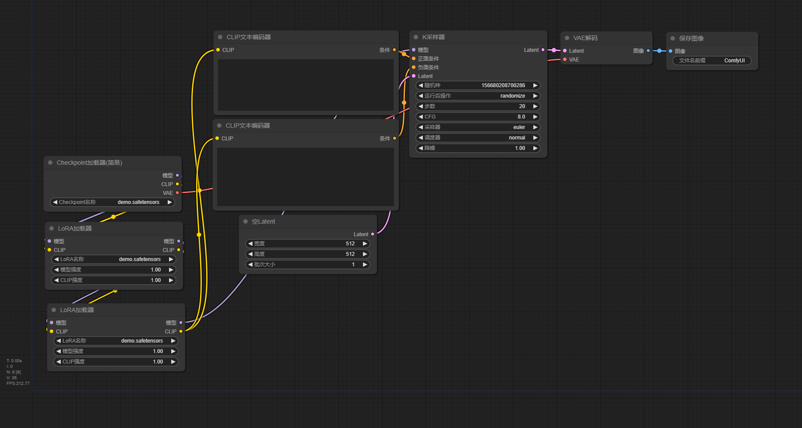

# 使用[ComfyUI](https://github.com/comfyanonymous/ComfyUI): 从零开始~~制作涩图~~AI绘画

QQ群: 670194395

## 快速开始

### AI绘画的基本原理是什么?

**1. 提示词编码**

将文字提示转换为向量表示, 供模型理解

**2.  随机噪声初始化**

生成一张潜空间中的随机噪声图像, 作为起点

**3. 扩散采样(反向去噪)**

结合提示词, 逐步引导latent图像向目标图像逼近

**4. 图像解码(VAE Decode)**

将处理完成的latent图像还原为可视图像

**5. 图像输出**

显示或保存最终生成的图像

**简单来讲, AI绘画就是根据提示词通过不断地预测一张随机噪声图中不必要的部分, 从而对其进行降噪, 最后降噪为我们需要的图片**

### ComfyUI基本工作流怎么搭建？

根据AI绘画原理, 我们可以搭建出以下这个基本工作流:


其中：
- Checkpoint加载器(简易): 用于加载你的AI绘画基本模型, AI模型应放置于comfyUI文件夹下的models/checkpoints路径下
- CLIP文本编码器: 用于输入正向提示词和反向提示词
- 空Latent: 用于生成初始latent图像作为起点
- K采样器: 用于控制噪声逐步去除过程的组件, 将随机或编码图像逐步变换为符合提示词的图像
- VAE解码: 将处理完成的latent图像还原为可视图像
- 保存图像: 保存图像至本地

现在你就能搭建最简单的comfyUI工作流啦!

## 进阶一: 同人图制作与图生图(img2img)技术

### 检查你的checkpoint模型

下载模型时一般会有一些参数需要注意, 这里以[civitai](https://civitai.com)为例:


其中, Based Model指的是这个模型的类型. 常见的类型有SD1.5, SDXL, Illustrious, Pony, NAI等, 不同的模型在使用时有所不同.

这张图中, 我们可以看见这个模型的Based Model是NAI

### 如何制作同人图
通常有两种方法: 

**1. 使用模型直接生成**

有的模型在训练时就已经训练过一些热门角色, 例如NoobAI就包含[danbooru](Materials/danbooru_artist_webui.csv)中的角色

对于这样的模型只需要直接在提示词里写上角色名, 作品名, 以及角色的简单外貌描述即可生成该角色的同人图

例如: 

```
1girl, gotou hitori, bocchi the rock!, blue eyes, pink hair,cube hair ornament, ahoge, bangs, hair between eyes
```

这里首先声明了**角色数量**(1girl), 然后声明了**角色与作品**(gotou hitori, bocchi the rock!), 最后简单描述了**角色外貌**(blue eyes, pink hair,cube hair ornament, ahoge, bangs, hair between eyes), 于是我们就能得到波奇酱的图片了

**2. 使用LoRA生成**

LoRA(Low-Rank Adaptation)是一种高效微调大模型的方法, 常用于 AI 绘图中定制特定风格或人物. LoRA模型应放置于comfyUI文件夹下的models/loras路径下

使用LoRA需要修改工作流: 



可以看到这里将LoRA模型和checkpoint模型串联, 相当于是一个新模型, 其中, LoRA模型有以下参数:

- **模型强度**: 控制 LoRA 对 UNet(图像生成核心模块)的影响程度, 数值越高, 图像更符合 LoRA 的风格或角色
- **CLIP 强度**: 控制 LoRA 对文本编码器(CLIP)的影响程度, 数值越高, 能更强地引导提示词的语义并提高提示词对结果的控制力

**这两个参数均可为负数, 为负数时将起到抑制的效果**

不同的LoRA有不同的适用环境, 在下载时可以看见这些参数, 这里以[civitai](https://civitai.com)为例: 


可以看到这里这个LoRA的Based Model是Pony, 也就是说这个LoRA只能与Pony的checkpoint模型配合使用

所有checkpoint模型的Based Model必须和LoRA模型的Based Model相同才能使用, 例如, SD1.5的LoRA一般不能给SDXL的checkpoint模型使用, 不过一般SDXL, NAI, Pony, Illustrious的LoRA可以通用.

此外, 我们还可以看到LoRA模型是有触发词(Trigger Words)的, 例如该图中的触发词是:

```
hitori gotou, blue eyes, cube hair ornament, hair between eyes, hair ornament, pink hair, one side up, long hair,
```
```
black skirt, jacket, long sleeves, pants, pants under skirt, pink jacket, pink pants, pleated skirt, skirt, track jacket, track pants, track suit,
```
因此, 在使用LoRA时需要输入这些触发词才能使LoRA发挥作用, 生成特定的角色或风格
